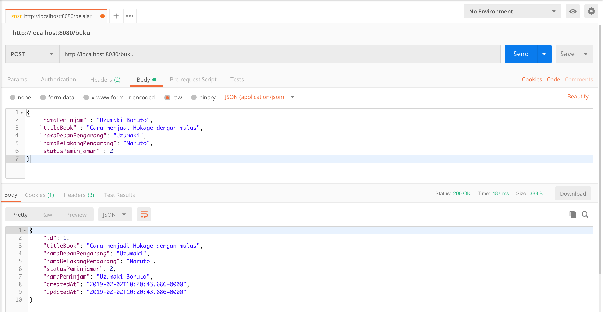
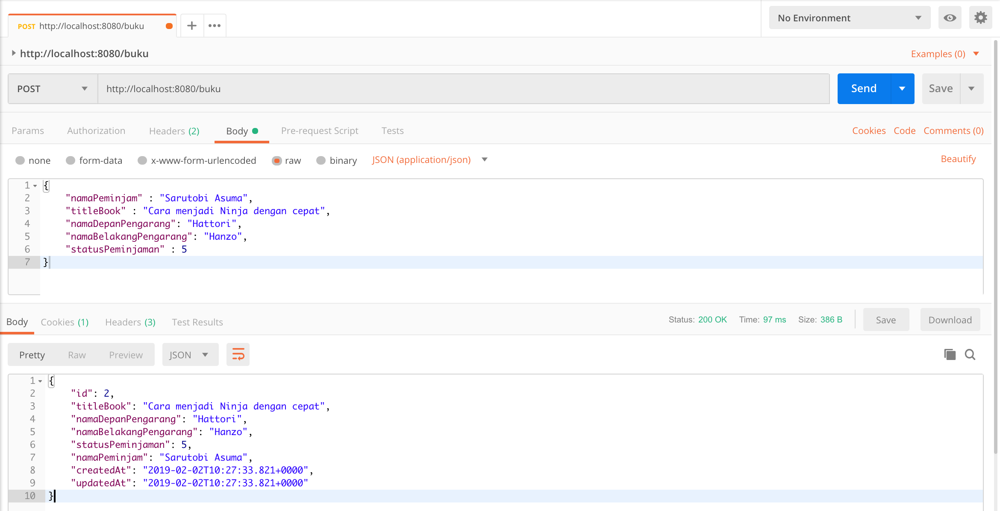
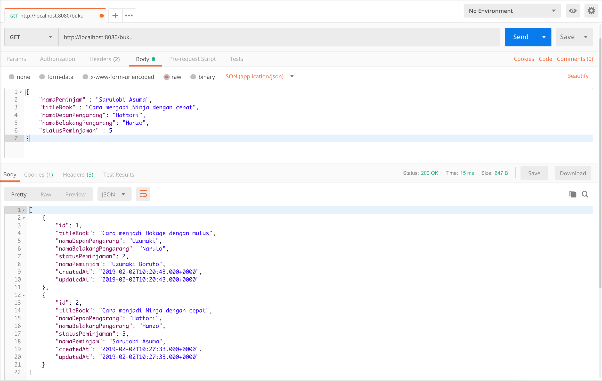
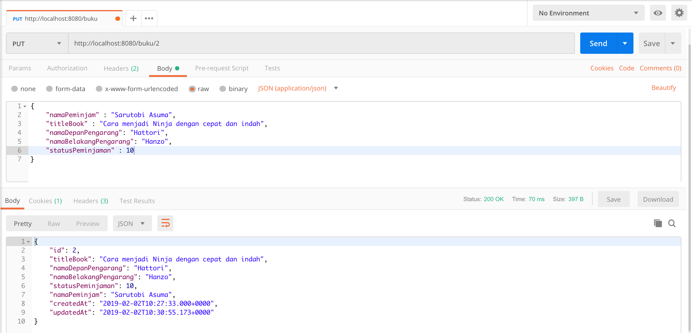
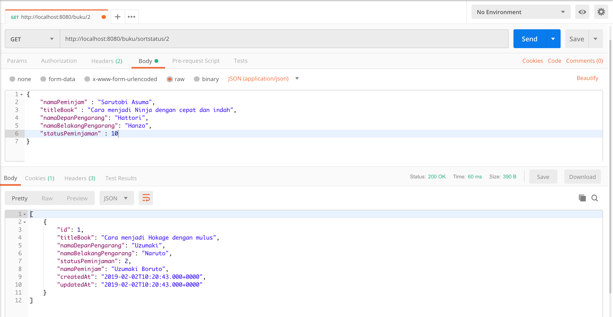
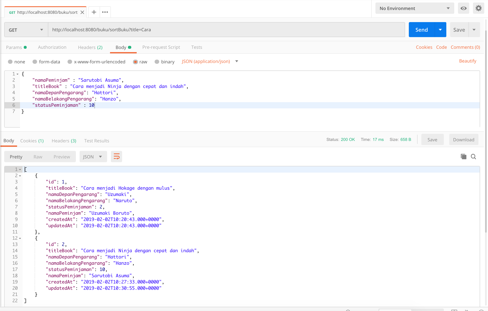

# springboot-book-rest-sample

#### Things to do
1. Clone this repo : `git clone git@github.com:hendisantika/springboot-book-rest-sample.git`
2. Go to the folder : `cd springboot-book-rest-sample`
3. Change MySQL Database username & password based on your MySQL database.
4. Run this command : `mvn clean spring-boot:run`

#### Screen shot

Add new Book

Get Book List

Update Book

Get Book by Status

Get Book by Title

